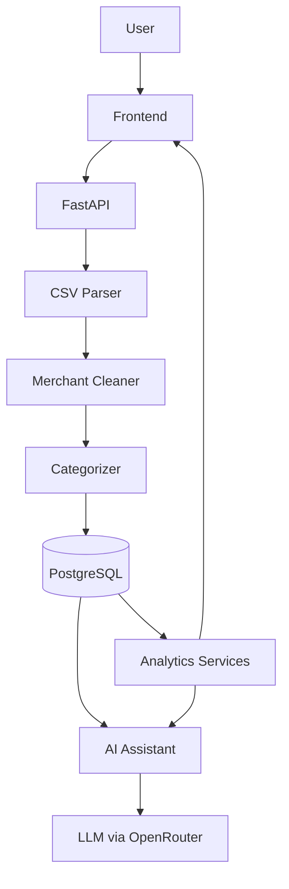

# FinSight AI

*Understand where your money goes.*

A full-stack personal-finance analytics platform: import a bank statement, get it
automatically cleaned and categorized, explore spending analytics, and ask an AI
financial assistant questions about your own data — answered from numbers computed
by verified application code, never guessed by the model. Built end-to-end (schema,
API, ML, auth, production deployment) as a portfolio project.

**Educational project. Not financial advice.**

**🔗 Live demo:** [finsight-frontend-6gts.onrender.com](https://finsight-frontend-6gts.onrender.com)
**📑 API docs:** [finsight-api-pfqj.onrender.com/docs](https://finsight-api-pfqj.onrender.com/docs)

> Hosted on Render's free tier — the backend spins down after 15 minutes idle, so
> the first request after a quiet period can take 30–60s to wake it up. Sign up for
> a free account to try the full flow with your own (or the bundled sample) data.

---

## Overview

FinSight AI takes a raw CSV bank statement and turns it into something you can
actually reason about: every transaction is cleaned, categorized, and checked for
anomalies and recurring patterns; income, spending, and savings trends are computed
directly in SQL/Python; and an AI assistant is available to answer free-form
questions — but only ever by reading back numbers the application already computed
and verified, never by inventing its own.

That last point is the project's core design rule, carried through every layer:
**numbers are computed in Python/SQL; the LLM only explains verified results.**

## Key Features

- **CSV import pipeline** — upload a bank statement; it's parsed, validated,
  deduplicated (by date + amount + description + account), and persisted in one pass.
- **Merchant cleaning** — strips order IDs and noise from raw descriptions
  (`"SWIGGY*ORDER #5506"` → `"SWIGGY"`) into a dedicated, queryable column.
- **Hybrid categorization** — a fast rule-based keyword engine labels most
  transactions immediately; a TF-IDF + Naive Bayes classifier is trained on your
  own labeled history and only ever *improves* a low-confidence rule-based guess,
  never overwrites a user's manual correction.
- **Analytics dashboard** — income/expense/savings summary, spending by category,
  monthly trends, top merchants, all scoped per user and per account.
- **Recurring payment detection** — finds subscriptions and regular bills from
  transaction history automatically.
- **Anomaly detection** — flags unusual transactions statistically, not by a fixed
  threshold.
- **Expense forecasting** — a transparent linear-trend forecast over monthly
  expenses, with an explicit, honest fallback for users with little history instead
  of a confident-looking guess.
- **AI financial assistant** — ask free-form questions ("How much did I spend on
  food last month?") or request a generated summary; every answer is grounded in a
  verified data snapshot assembled by the application and handed to the model as
  its only source of truth.
- **Secure multi-user accounts** — JWT-based signup/login, bcrypt-hashed passwords,
  and every single query scoped to the authenticated user — never a client-supplied id.

## Architecture

Clean separation by responsibility, no business logic in HTTP routes:

| Layer | Location | Responsibility |
|---|---|---|
| UI | `frontend/` | Static HTML/CSS/vanilla JS + Chart.js; talks only to the REST API |
| API | `backend/app/api/` | HTTP routing, request validation, status codes — thin |
| Business logic | `backend/app/services/` | ingestion, cleaning, categorization, analytics, recurring, anomalies, forecasting, auth, AI orchestration |
| ML | `backend/app/ml/` | TF-IDF classifier training and prediction |
| Database | `backend/app/models/`, `backend/app/db/` | SQLAlchemy models, sessions, Alembic migrations |
| AI | within `app/services/` | verified analytics → LLM explanation, never the reverse |



Request flow for an upload: **parse → clean → categorize (rule, then ML) → persist
→ analytics recompute on demand.** Nothing is ever categorized or summarized by the
LLM — it only ever reads back what the pipeline already verified.

## AI/ML Pipeline

Three layers, each with a clear job and clear limits:

1. **Rule-based categorizer** (`app/services/categorization.py`) — fixed keyword
   rules give most transactions an instant, explainable category and a confidence
   score; low-confidence matches are flagged `needs_review`.
2. **ML classifier** (`app/ml/train.py`, `app/ml/predict.py`) — a TF-IDF +
   Multinomial Naive Bayes model trained on your own already-labeled transactions
   (rule-assigned, ML-assigned, or user-corrected). It only ever replaces a label
   when it's *strictly more confident* than the rule engine's guess, and a user's
   manual correction is never touched by either layer.
3. **AI assistant** (chat + generated summaries, via [OpenRouter](https://openrouter.ai)) —
   given a system prompt containing a JSON snapshot of the user's *own* verified
   analytics (summary, category breakdown, trends, recurring payments, anomalies,
   forecast, recent transactions) and instructed explicitly never to invent a
   number not present in that data. The model explains; it never calculates.

This separation means the AI layer can be swapped, retried, or degraded (e.g. the
provider is temporarily unavailable) without ever risking a wrong financial figure
reaching the user — the number either comes from verified code, or the assistant
says it doesn't have the data to answer.

## Tech Stack

**Backend** — Python, FastAPI, SQLAlchemy 2.x, Alembic, PostgreSQL, Pydantic,
pandas, scikit-learn, bcrypt, PyJWT, slowapi (rate limiting)

**Frontend** — vanilla HTML/CSS/JavaScript (no framework, no build step), Chart.js

**AI** — OpenRouter (model-agnostic LLM routing)

**Infrastructure** — Docker, Render (Blueprint-based deployment: API + static
frontend + managed PostgreSQL), GitHub


## Getting Started (GitHub Setup)

```bash
git clone https://github.com/Anirudh-Jakkani/FinSight-AI.git
cd FinSight-AI

docker compose up -d db             # PostgreSQL
cd backend
python -m venv venv && source venv/bin/activate   # Windows: venv\Scripts\activate
pip install -r requirements.txt
cp .env.example .env                # fill in JWT_SECRET_KEY and OPENROUTER_API_KEY
alembic upgrade head                # create the schema

uvicorn app.main:app --reload
```

Open `http://127.0.0.1:8000/docs` for interactive API docs, and check `/health` +
`/health/db`. Then serve the frontend (`python frontend/serve.py`, a same-origin
dev proxy) and open `http://127.0.0.1:5500`.

`data/sample_transactions.csv` is a **synthetic** 90-transaction dataset
(`data/generate_sample_data.py` generates it) — upload it through the dashboard to
try the full pipeline immediately without needing a real bank statement.

## Deployment

The app ships as a Docker image and deploys the same way locally or in production:

```bash
docker compose up -d --build        # PostgreSQL + API, for local parity testing
```

Production deployment is documented in two places:
- **[`docs/deployment.md`](docs/deployment.md)** — the platform-agnostic picture:
  required environment variables, the single-process server rationale, health
  checks, and the demo-seed command.
- **[`docs/render-deployment.md`](docs/render-deployment.md)** — deploying the
  whole stack (API + frontend + database) to [Render](https://render.com) from the
  included [`render.yaml`](render.yaml) Blueprint in one step. This is exactly how
  the live demo above is deployed.

## Security

- **Authentication**: JWT access tokens; passwords hashed with bcrypt (per-password
  salt, deliberately slow). No fallback to a guessable secret — the app refuses to
  issue or verify tokens if `JWT_SECRET_KEY` isn't configured.
- **Authorization / data isolation**: every API query is scoped to the
  authenticated user's id taken from the verified JWT — never a client-supplied
  parameter. A request for another user's account, conversation, or transaction
  returns nothing, not an error that confirms it exists.
- **Rate limiting**: signup, login, uploads, the ML/AI endpoints, and chat are all
  rate-limited against brute-force and resource-exhaustion.
- **CORS**: explicit origin allowlist via environment configuration; never a
  wildcard.
- **Input validation**: every request body is a typed Pydantic schema; emails and
  passwords are validated before touching the database.
- **No raw SQL**: every query goes through SQLAlchemy's query builder — no
  string-formatted SQL anywhere in the codebase.
- **Secrets**: never committed. `.env` is gitignored and dockerignored; production
  secrets are injected as environment variables (Render's dashboard / generated
  values), never baked into the image or the repo.

## Future Improvements

- Move rate limiting to a shared backend (Redis) to support multiple server
  instances — today's in-memory limiter is a deliberate single-process design.
- Cap or summarize AI chat conversation history server-side, so cost and context
  usage stay bounded as a conversation grows long.
- Push the heavier analytics aggregations (top merchants, anomaly detection,
  recurring-payment grouping) from Python into SQL for better scaling past a few
  thousand transactions per user.
- Multi-account support in the UI (the data model already supports multiple
  accounts per user).
- CI pipeline (automated tests + build on every push).
- Bank/aggregator API integration (e.g. Plaid-style) as an alternative to manual
  CSV upload.
- Mobile-responsive dashboard layout.

---

**Author:** [Anirudh Jakkani](https://github.com/Anirudh-Jakkani)
