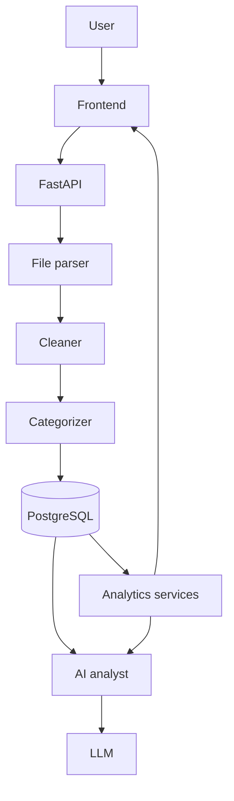

# Architecture

Layers (each in its own package; no business logic in routes):

| Layer | Location | Responsibility |
|---|---|---|
| UI | `frontend/` | Static HTML/CSS/vanilla JS + Chart.js; talks only to REST |
| API | `backend/app/api/` | HTTP, Pydantic validation, status codes; thin |
| Business logic | `backend/app/services/` | parsing, cleaning, categorizing, analytics, recurring, anomalies, forecasting |
| ML | `backend/app/ml/` | TF-IDF classifier training/prediction |
| Database | `backend/app/models/`, `db/` | SQLAlchemy models and sessions |
| AI | `backend/app/ai/` | question -> verified analytics -> LLM explanation |

Key rule: numbers are computed in Python/SQL; the LLM only explains verified results.
Status: through Phase 8.8 — all layers above are implemented; see `docs/deployment.md`
for how the API is packaged and run in production.
